# CloudFaster Academy: Demonstração de utilização da API Gateway + Lambda + DynamoDB

> **Autor:** [CloudFaster Tecnologia](https://cloudfaster.com.br), **Última revisão:** 24/10/2022

Neste tutorial iremos te ajudar a criar uma função Lambda que será vinculada a uma Api Gateway para receber dados e grava-los no DynamoDB.

## Pré-requisitos

1) Uma conta na AWS
2) Um usuário com permissões suficientes para acessar os recursos necessários (IAM, Lambda, DynamoDB e API Gateway).

## Passo 1: Criar uma Role do IAM

Após acessar sua conta AWS, navegue até o serviço "IAM Roles" ou acesse diretamente por esse link: <https://console.aws.amazon.com/iamv2/#/roles>

Na tela do serviço, será listada todas as roles disponíveis e teremos um botão *"Create role"*. Clique nele.

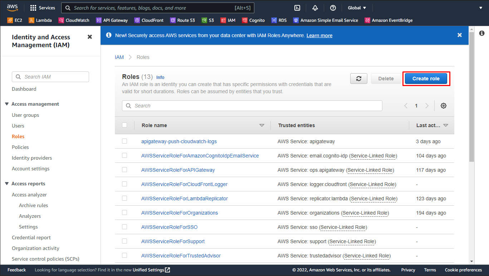

Na tela de criação de nova Role, selecione o tipo de entidade confiável *"AWS service"*, selecione o caso de uso *"Lambda"* e clique em *"Next"*.

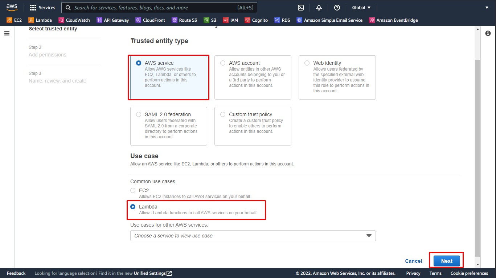

Será solicitada quais permissões (policies) você deseja adicionar, procure e selecione *"AWSLambdaBasicExecutionRole"* e *"AmazonDynamoDBFullAccess"* em seguida, clique em *"Next"*

> **Atenção:** Não é aconselhavel utilizar uma IAM Policy de Full Access. Seguindo as boas práticas de segurança, é sempre recomendável utilizar permissões granulares com o menor privilégio. Utilizaremos essa IAM Policy apenas para fins didáticos.

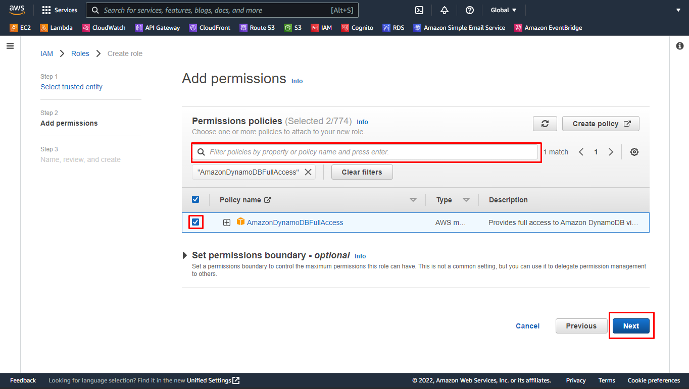

Dê um nome para sua Role, para fins de exemplo utilizarei "role-lambda-access-dynamodb", revise os dados e em seguida clique em *"Create role"*

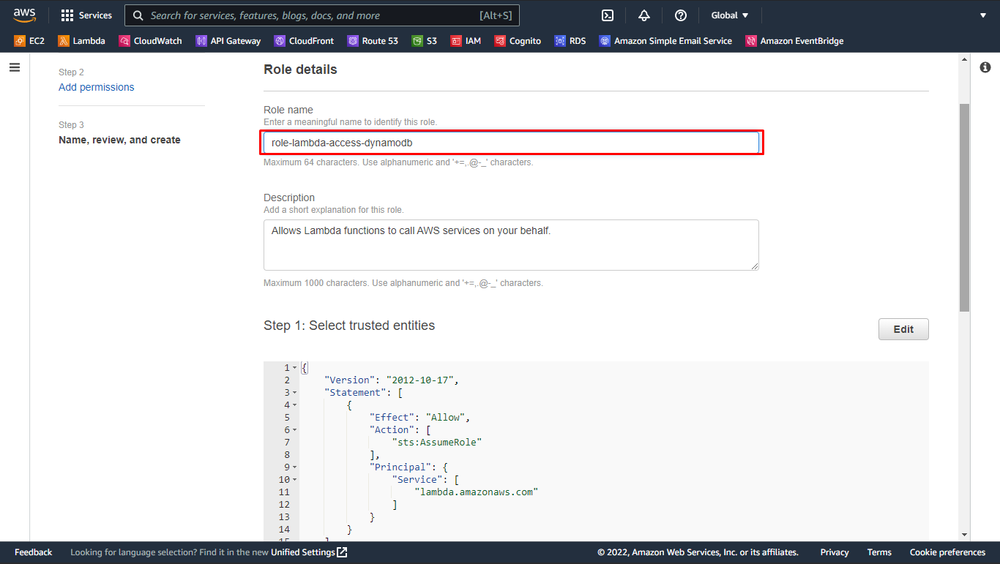

Pronto sua IAM Role, está criada e pronta para ser anexada à sua função Lambda, podemos seguir para o passo 2.

## Passo 2: Criar a tabela no DynamoDB

Essa tabela será necessária para armazenar os dados da nossa aplicação, não aprofundaremos em conceitos NoSQL, utilizaremos apenas para fins didáticos.

Após acessar sua conta AWS, navegue até o serviço "DynamoDB" ou acesse diretamente por esse link: <https://console.aws.amazon.com/dynamodbv2/#tables>
No dashboard do serviço, procure pelo botão *"Create table"* e clique.
Na tela de criação da tabela, dê um nome para nossa tabela, para fins de exemplo utilizarei "lab-dynamodb", e informe uma partition key, para nosso exemplo utilizarei `id`. Mantenha o restante das configurações conforme sugerido, e clique em *"Create table"*
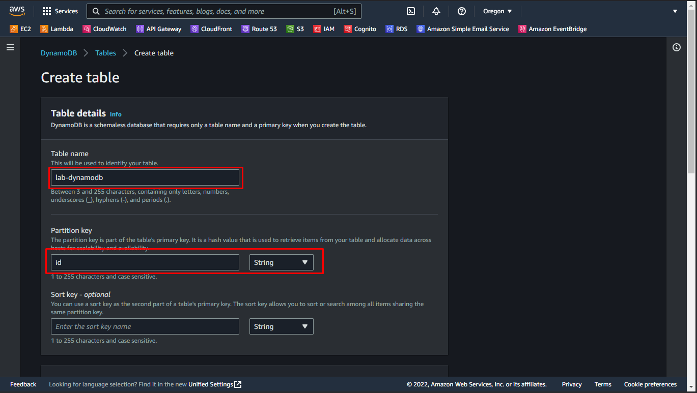

> **Atenção:** Verifique qual a região da AWS você criou a tabela, pois precisaremos dessa informação para que nosso Lambda possa acessar o serviço.

## Passo 3: Criar a função Lambda

Após acessar sua conta AWS, navegue até o serviço "Lambda" ou acesse diretamente por esse link: <https://console.aws.amazon.com/lambda>

Na tela do serviço será listado todas as funções lambdas disponíveis para a região selecionada e teremos um botão *"Create Function"* no canto superiror direito da listagem. Clique nele.
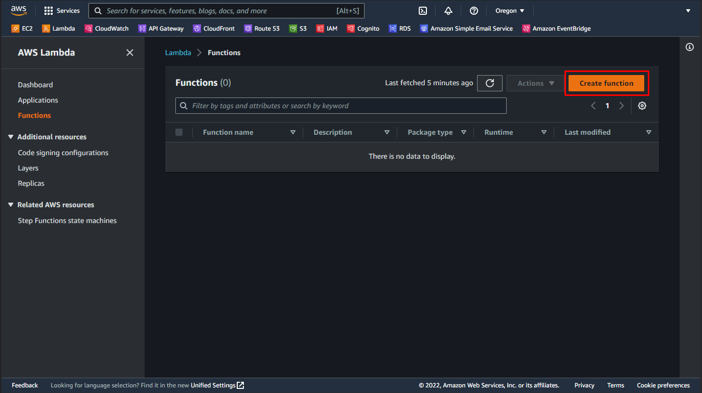

Na tela seguinte, mantenha a opção *"Author from scratch"* selecionada, informe um nome para sua função, escolha um *Runtime* e a arquitetura que você quer que seu código seja executado, para esse exemplo utilizaremos Python 3.9 em uma arquitetura x86_64.
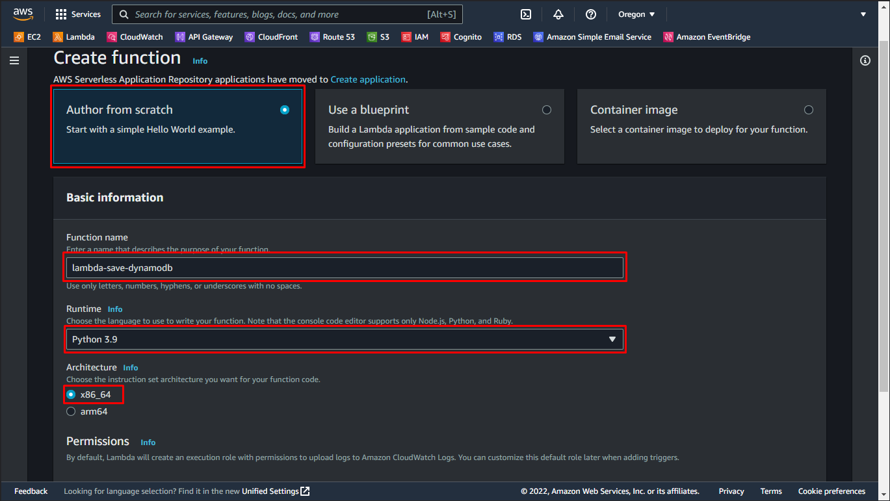

Role a tela um pouco para baixo e abra as opões presentes em *"Change default execution role"*, marque a opção *"Use an existing role"* e no campo *"Existing role"* selecione a Role IAM criada no passo 1, em seguida, clique em *"Create Function"*.
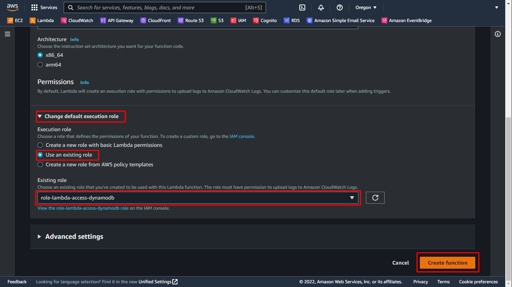

Sua função Lamda será criada e será possível editar o código diretamente no *Browser*. Apague o conteúdo do arquivo "lambda_function.py" aberto no editor de código da função Lambda, copie todo o conteúdo do arquivo `lambda-save-dynamodb.py` disponível neste repositório, e cole no editor de código da função lambda. Em seguida substitua as variáveis `DYNAMODB_TABLE` e `AWS_REGION` com os valores corretos para sua tabela do DynamoDB criado no passo 2. Ao finalizar clique em *"Deploy"*.
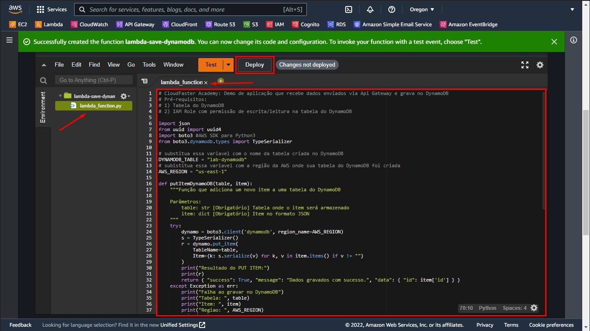

Agora iremos testar nossa nova função Lambda, clique em *"Test"*. Será aberta uma tela de configuração do evento, nele iremos informar um nome para nosso teste e o JSON que será recebido como evento. Utilize o seguinte JSON para fins de teste.

```json
{
    "nome": "Willy Wonka",
    "idade": 38,
    "jogo": "A Fantástica Fábrica de Chocolate",
    "pontuacao": 1000
}
```

Ao finalizar, clique em *"Save"*
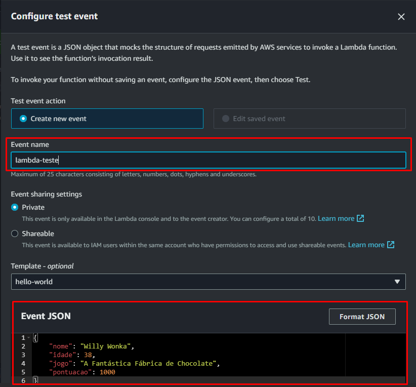

Assim que o novo evento de teste for criado, você poderá rodar sua função Lambda para teste, basta clicar na seta no botão *"Test"*. Tudo ocorrendo bem você verá uma mensagem de sucesso, conforme imagem abaixo:
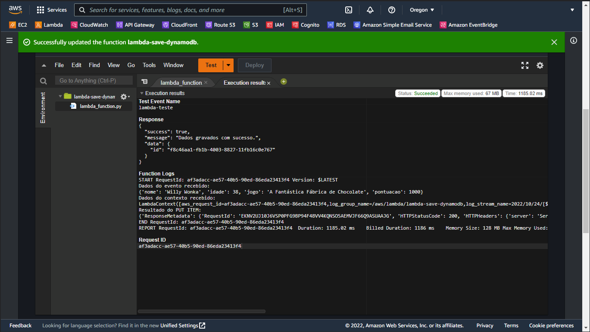

Você pode verificar se tudo ocorreu bem acessando a tabela do DynamoDB e verificando se o dado foi adicionado corretamente.
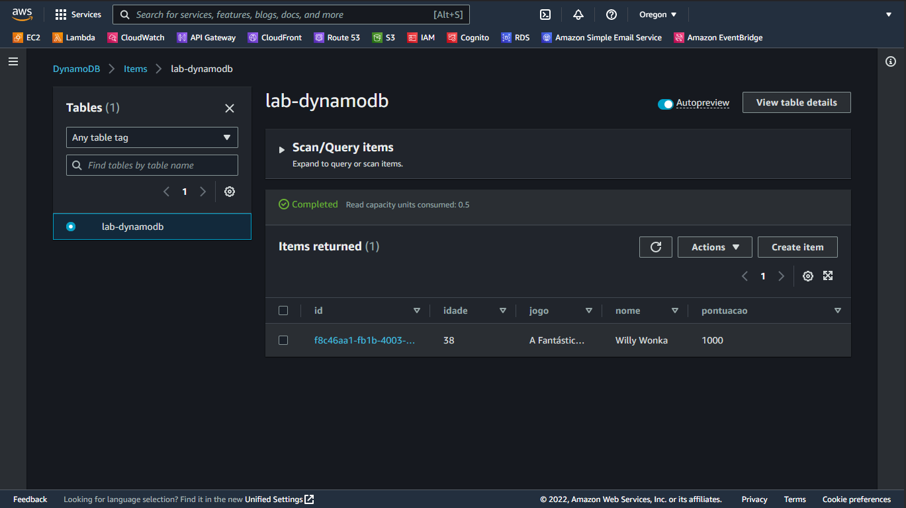

## Passo 4: Criar o vinculo do Lambda com a API Gateway

Após acessar sua conta AWS, navegue até o serviço "Api Gateway" ou acesse diretamente por esse link: <https://console.aws.amazon.com/apigateway>.

Na tela do serviço, procure pela opção *"REST API"* e clique em *"Build"*. Na tela que será aberta aparecerá um pop-up de boas-vindas, clique em OK.
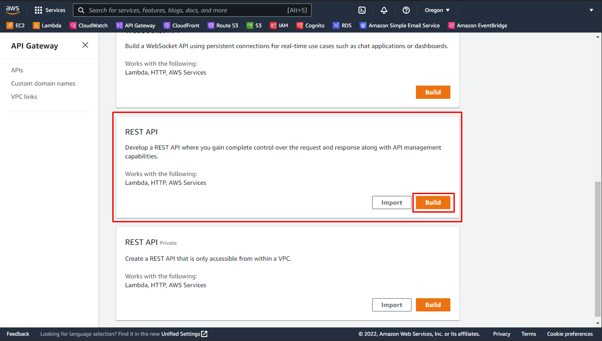

Informe o protocolo da sua nova API, "*REST*", infor que você deseja criar uma nova API selecionando *"New API"* e informe um nome para sua API compo por exemplo: *"lambda-integration"*.
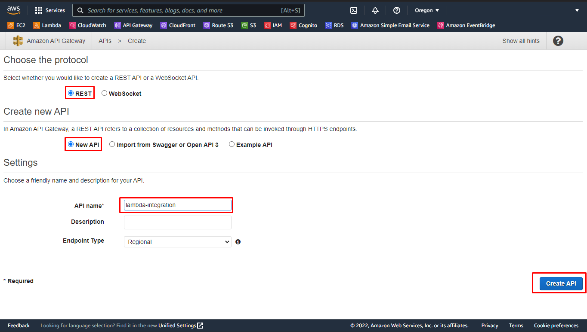

Na próxima tela, clique em *"Actions" > "Create Method"* aparecerá um campo seletor, selecione o método POST e clique no simbolo de "check".
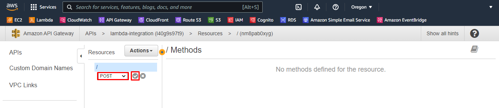

Configure seu Lambda criado no passo 3 como integração da API Gateway, marcando o tipo de integração como *"Lambda Function"*, selecione a região onde seu Lambda foi criado e informe o nome da função Lambda criada, em seguida clique em "*Save*".
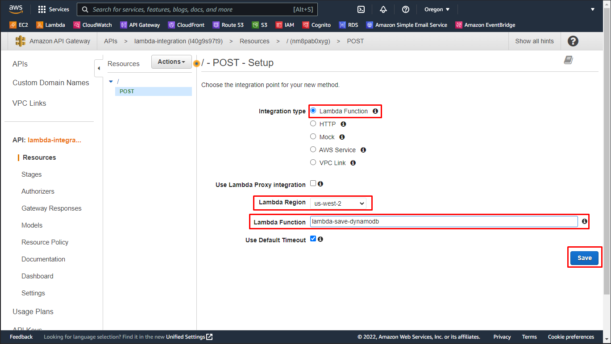

Um pop-up de verificação aparecerá perguntando se você tem certeza que deseja dar permissão para a API Gateway de invocar a Função Lambda, clique em *"OK"*.
Após criado o método, vamos configurar o CORS da API, nesse caso vamos liberar o CORS para qualquer origem, basta acessar o botão *"Actions"* e em seguida *"Enable CORS"*
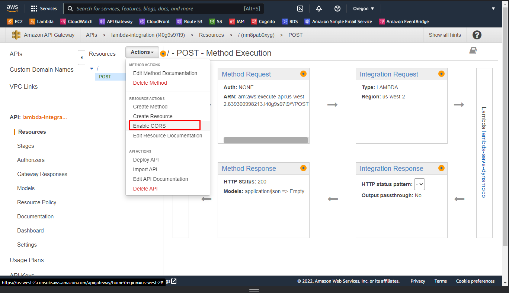

Na próxima tela, revise dos dados da configuração do CORS e clique em *"Enable CORS and replace existign CORS headers"*.
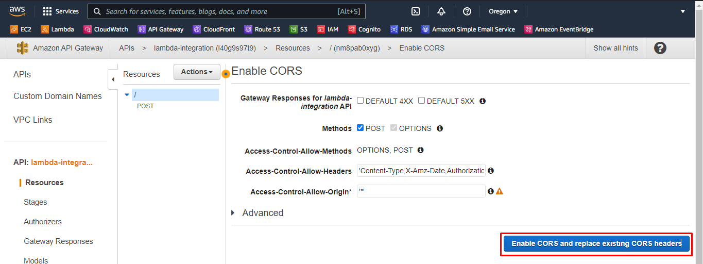

Um pop-up surgirá para confirmar as alterações, clique em *"Yes, replace existing values"*.
Finalizado essa parte, nossa API já está pronta para ser implantada, para isso vamos acessar novamente o botão *"Actions"* e em seguida *"Deploy API"*, um pop-up com os detalhes da implantação irá aparecer, se nenhum estágio da API tiver sido criada antes, vai aparecer uma opção de [New Stage] para *"Deployment stage"* e pedirá o nome do estágio, para testes informe *"test"*, em seguida clique em *"Deploy"*.
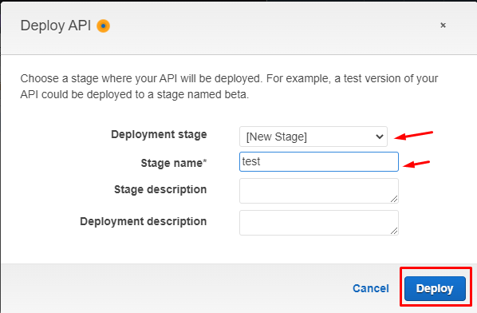

Pronto, sua API está implantada e pronta para receber as requisições. Em *"Stages"* você consegue visualizar o endpoint que você pode utilizar para suas requisições.
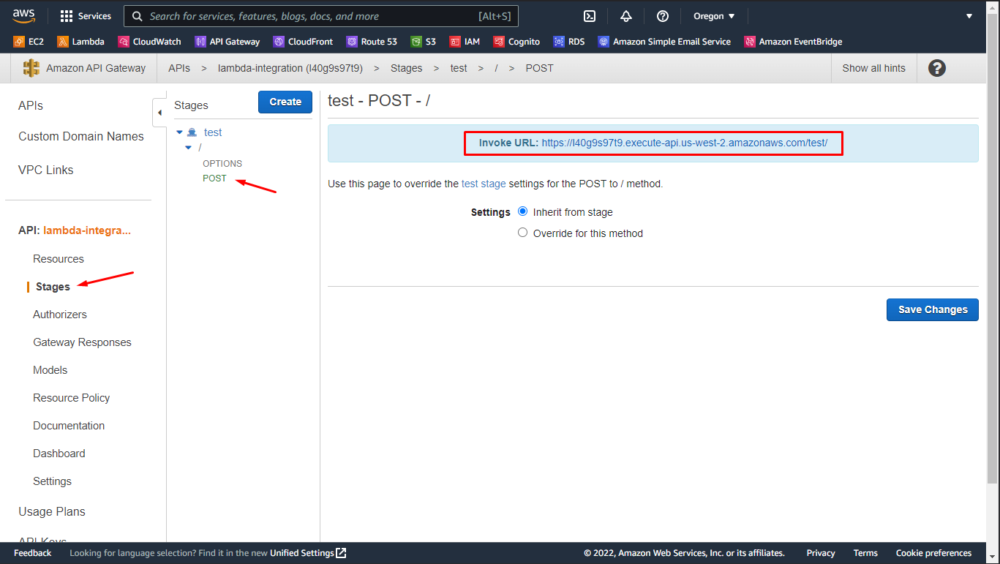

Para testar, você pode utilizar o PostMan para realizar suas resquisições e em seguida verificar no DynamoDB se os dados foram inseridos corretamente.
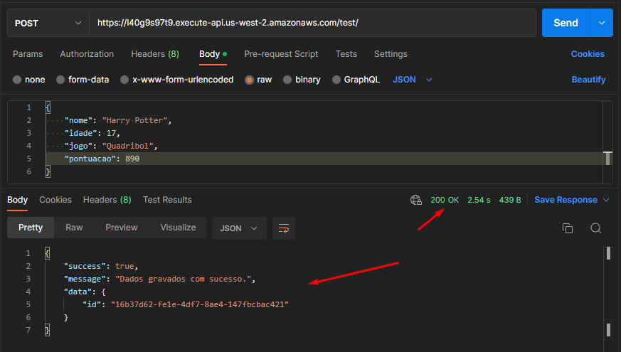
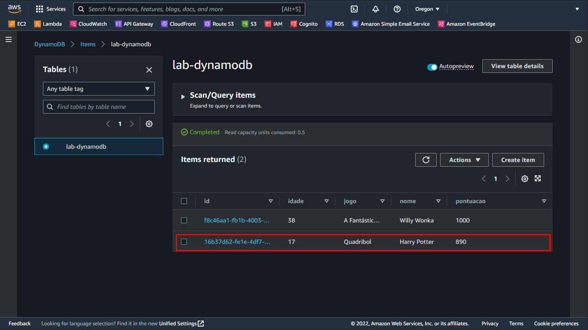
